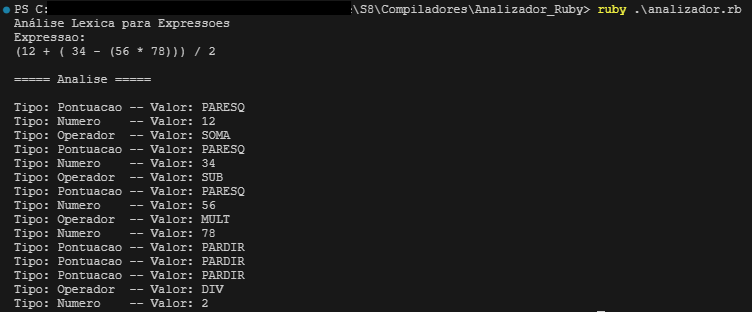

# Trabalho Computacional 03 Equipe 04 - Compiladores

## Descrição
A atividade consiste em implementar um analisador léxico originalmente na linguagem C, na linguagem Python. O analisador léxico deve ser capaz de reconhecer os seguintes tokens:

- Numeros: inteiros e reais [0-9]+
- Operadores: +, -, *, /
- Pontuação: (, )

## Testes
### Teste em C (Código Original)

### Teste em Python (Código Modificado)

## Integrantes
 
| Nome                                 | GitHub                                                 |
|--------------------------------------|--------------------------------------------------------|
| Francisco Alan do Nascimento Marinho | [@alanmarinho](https://github.com/alanmarinho)         |
| Francisco Erineldo Xavier Filho      | [@erfilho](https://github.com/erfilho)                 |
| Janiel de Oliveira Silva             | [@Janiel-Oliveira](https://github.com/Janiel-Oliveira) |
| Rubens Lima Duarte                   | --                                                     |
